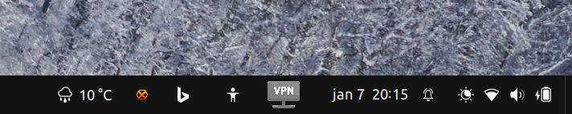
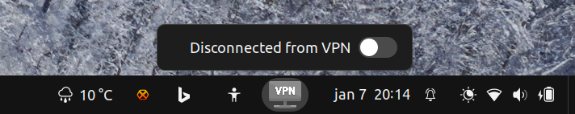
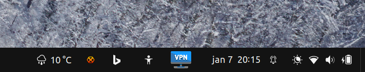
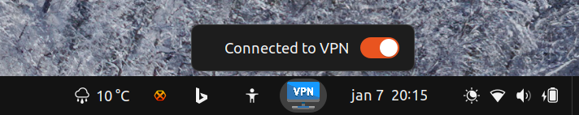

# GNOME Shell Extension - VPN Connection Button
This is a gnome shell extension that adds a VPN connection button to your taskbar.  
When the user clicks on it, the extension will execute a script that establishes e.g. a VPN connection.  

# Goal
This project primarily deals with creating a VPN connection, but this is not necessary. In general, a button is created on the taskbar and when clicked, a script is started.  
However, with some modifications, it is pretty easy to start a different application (it doesn't have to be a VPN connection).  
Or with other words. **The goal of this project is to create a button on the taskbar that executes a script when clicked.**  
Thus feel free to modify the code to your own needs.

<div>
<br/>
<br/>
<br/>
<br/>><br/>
</div>

# Pre-requisites
 1. A script that will be executed when the button is clicked.   
  In this example, we'll use the following script: `my_vpn_connector.sh`.  
  What this script does is, it establishes a VPN connection using the _openconnect library_.

 1. Add the my_vpn_connector.sh script to the sudoers file.  
    Unfortunately, the `my_vpn_connector.sh` script should be executed as a sudo user.  
    This means that we'll be prompted for a password when we execute the script.  
    To avoid this, we can add the script to the *sudoers* file in such a way  
    that we don't have to enter a password when executing the next command:
    ```shell
    sudo /home/<username>/my_vpn_connector.sh
    ```

    **Steps**:
    1. Open visudo in a terminal: 
    ```shell 
    sudo visudo
    ```  
    2. Add the following sentence at the end of the file:   
    ```shell
    <username> ALL=(ALL) NOPASSWD: /home/<username>/my_vpn_connector.sh
    ```

    **Result:**   
    -  When the user with username: <username> executes the script, (s)he won't be prompted for a password anymore.   
       <br>

 1. Add `/usr/bin/pkill --signal SIGINT openconnect` to the sudoers file.  
    If we want to close the *VPN Connection*, we've to execute the above command.  
    But likewise in step 2, we'll be prompted for a password when we want to kill the openconnect process:
    ```shell
    sudo /usr/bin/pkill --signal SIGINT openconnect
    ```
    To avoid this, we can also add this command to the *sudoers* file in such a way  
      that we don't have to enter a password.

    **Steps**:
    1. Open visudo in a terminal: 
    ```shell 
    sudo visudo
    ```  
    2. Create an alias for the *pkill* command, which will terminate the openconnect process:
    ```shell
    # Cmnd alias specification
    Cmnd_Alias KILL_OPENCONNECT = /usr/bin/pkill --signal SIGINT openconnect
    ```

    3. Add the following sentence at the end of the file:   
    ```shell
    <username> ALL=(ALL) NOPASSWD: KILL_OPENCONNECT
    ```
    **Result:**   
    -  When the user with username: <username> executes the above command, (s)he won't be prompted for a password anymore.
       <br>

1. Restart GNOME.  
   log out and log in again, or **alt + f2** and type **r**.


# Installation
 1. Create a folder e.g. `vpn@openconnect.com` into the next directory: `/home/<username>/.local/share/gnome-shell/extensions/`  
    (Note that this folder name should be exactly the same as the project names in the metadata.json file)   
 1. Download the extension files into the folder that you created in the previous step.  
    1. Your folder structure should look like this:
        ```
         - vpn@openconnect.com
            - img
              - icon_connected.svg
              - icon_disconnected.svg
            - extension.js
            - metadata.json
            - stylesheet.css
 1. ! Check if the `name` and `uuid` fields in the `metadata.json` file are the same as your specified folder name.
 1. Edit the `extension.js` file and change the `PATH_SSH_SCRIPT` variable to the path of the script that you want to execute when the button is clicked.    
    (Note that the script should be executable)
 1. log out and log in again, or **alt + f2** and type **r**.  

 1. The Gnome Shell Extension should now be visible in your extensions list.
    1. Enable the extension
 1. The extension should now be visible in your taskbar 


extra:
1. you can change whatever you want in the `extension.js` file.  
   For example, you can change the icon that is displayed when the VPN is connected or disconnected.  
   To do this, you have to change the `icon_connected` and `icon_disconnected` variables in the `extension.js` file.  
   (Note that the icons should be in the `img` folder and styled in the `stylesheet.css` file).

1. Restart Gnome Shell to see the changes.
    1. **alt + f2** and type **r**.


# Debugging
To debug the extension, open a terminal and run the following command:
```shell
journalctl -f -o cat /usr/bin/gnome-shell
```
## Troubleshooting
If you encounter any issues with the extension, make sure that you have properly added the necessary scripts to the sudoers file as described in the Prerequisites section. Additionally, try restarting Gnome or your machine to see if that resolves the issue.